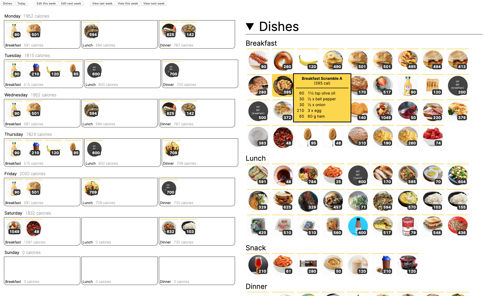

# food

A simple, ugly, desktop-only web app for meal prepping to count calories.



## About

This is a web app I made to count calories while cooking my own meals.

It is simple, stupid, and full of rough edges. You have to edit `.json` files to add
ingredients, calories, dishes, and combos. The UI is ugly and updates only through page
refreshes. And to use it, you have to run a server locally on your desktop, because
there's no login, no accounts, and not even a mobile UI. I made it feature by feature
only so that it would be useful for me personally.

And it works. Well, at least it worked for me. I lost a bunch of weight by counting
calories, saved money by cooking, saved time by meal prepping (and then spent it working
on this app 😊), and improved my cooking.

  

## How to use it

Let's walk through adding a new recipe, some _slow cooker chili_. Perfect for colder
months, and cooking in bulk so you have something to eat throughout the week.

### Adding a dish

Find a recipe on your favorite website or cookbook, and add an entry to
`data/dishes/dishes.json` (the keys are alphabetical for convenience):

```json
"chili": {
    "title": "Chili",
    "mealHint": "dinner",
    "ingredients": [
        "1 tbsp olive oil",
        "2 lbs ground beef (90% lean)",
        "1 onion",
        "6 cloves garlic",
        "2 can diced tomatoes",
        "24 oz tomato sauce",
        "0.5 cup beef broth",
        "2 tbsp chili powder",
        "2.5 tsp cumin",
        "2 tsp paprika",
        "2 tsp cocoa powder",
        "1 tsp sugar",
        "0.5 tsp coriander",
        "30 oz kidney beans"
    ],
    "img": "img/chili.png",
    "recipe": "https://www.cookingclassy.com/slow-cooker-chili/",
    "recipeServings": 5
},
```

Note that the format for each ingredient is `quantity unit thing` separated by spaces,
and that `recipe` and `recipeServings` keys are optional.

Save your (square-ish) image for this recipe in the appropriate folder, like
`img/chili.png`. Now, let's start up a web server and see how many calories it has:

```bash
# Serves HTTP on 127.0.0.1:8001
./server.sh
```

Point your web browser to `http://localhost:8001/` and click on the _"Dishes"_ button in the top left, or go directly to `http://localhost:8001/?view=dishes`. Then find the dish:


The ingredients are divided by 5 because we set the recipe to have 5 servings. But it
doesn't know how many calories are in an onion! Let's fix that.

### Adding an ingredient

Open up `data/calories.json` and add an entry (the keys here are also alphabetical,
ignoring the `[shopping]` prefix):

```json
"[produce] onion": [
    [30, "0.5 x"]
],
```

The format here is:

- `[produce]` — This prefix is optional, and can be any string that looks like `[.*]`.
  It's for if you later export all of your ingredients to a Reminders (the Apple app)
  shopping list, which auto-sorts items alphabetically. Having this prefix lets you hack
  it to organize your ingredients by grocery store section, so you're not constantly
  scrolling around your shopping list. (Shopping lists for a week's worth of meals can
  be huge.)

- `onion` — Ingredient name. Be careful with plurality (_onion_ vs _onions_), because
  ingredients are matched to _dishes_ using simple string matching. I try to
  consistently use singular.

- `30` — How many calories are in the upcoming serving

- `0.5 x` — The serving. Format is `quantity unit` with a single space in between. (Edit
  `KNOWN_UNITS` in `src/food/constants.ts`, and `UnitStandardize` in
  `src/food/conversion.ts`, to add more unit options.)

The app knows how to convert between different units for weight or volume. You can add
multiple entires for an ingredient. This is nice if you sometimes measure, and sometimes
go by units like cans or slices.

If we check out the app now, it should know about onions and be able to total up the
recipe:


### Meal planning

Now let's add the dish to our meal plan for the upcoming week. Click on the "Edit this
week" (or "Edit next week") button at the top of the page to go to the edit view. Note
that weeks begin on Mondays.

There are three ways you can edit weeks from this view:

1. Edit or copy in a _template_, which is a pre-made week plan. I won't cover templates
   in detail here, but templates behave like normal weeks. Create them by making `.json`
   files in the `data/weeks/templates/` folder, and running the
   `scripts/generate-templates.sh` script to build an index of them.

2. Drag and drop a _combo_ over to a _meal_. Combos are pre-made collections of dishes,
   which I use as shortcuts to hit calorie goals. You can edit combos in the
   `data/combos.json` file. They're just collections of dish names (keys in the dishes
   json file). This is as much as I'll cover combos here.

3. Drag and drop a _dish_ over to a _meal_. This is what we'll showcase here.

Observe:


To remove:


That's it! The meal and day calorie totals will update for every dish you add and
remove.

The bottom of the page houses an auto-generated grocery list and meal prep section for
the week:


If you need to edit the ingredients that show up in the _"Check on Hand"_ section, edit
`BULK_THINGS` in `src/food/constants.ts` (and don't forget to compile!). I use this for
ingredients like spices and oils that I rarely have to buy.

## Developing

This project is written in Typescript. The source files are in `src/food/`, and the app
is built to a single file: `build/food.js`.

If you're a serious web developer, you'll scoff at pretty much everything in here. I bet
building (a much better version of) this app would be a great starter project for
someone learning React, Redux, Elm, etc. The current version uses pure Typescript,
string templates to spit out HTML, page refreshes instead of tracking any state, and a
lot of ¯\_(ツ)_/¯.

## Notes

### Taxonomy

- **ingredient**: item with specific calories (e.g., chicken breast)

- **dish**: composed from ingredients; produced from one recipe (e.g., chicken pita
  wrap); to use other dishes as components (e.g., chicken pita wraps that use chicken
  marinade), must turn a dish into an ingredient; simpler composing is to use multiple
  dishes.

- **combo**: composed from dishes; aimed to reach a specific calorie goal (e.g., chicken
  pita wrap + baked Brussels sprouts).

- **meal**: composed from dishes; linked to a particular day and time; abstractly,
  identical to a combo in that it is simply a set of dishes, but semantically a combo is
  an abstract collection of dishes, and a meal is a set of dishes set to a particular
  day and time of eating; note that a combo can be dragged onto a meal, but this simply
  transfers the set of dishes, not the concept of a "combo."

- **day**: composed of up to seven meals: breakfast, morning snack, lunch, snack,
  afternoon snack, dinner, evening snack; by default, empty days are auto-generated with
  just three (breakfast, lunch, and dinner); linked to a calendar day

- **week**: composed of seven days, Monday through Sunday; linked to a calendar week

_Combos_ fill the gap between turning recipes into ingredients and dishes (low level), but
doing my weekly meal planning by caloric goals and how much meal prep I need to do (high
level). Why _templates_? Read on.

### Why templates?

Doing a full week of meal planning takes a long time because of trying to
- re-use ingredients throughout the week
- account for ingredients you already have
- account for packaging (e.g., 1 lb beef, 2 chicken breasts, loaf of bread, 6-pack buns)
- account for timing (e.g., exercise mornings w/o cook time, leftover save lengths)
- account for saving (meats, many vegetables, and premade salads don't last the week if
  bought on saturday beforehand)

Plus, you can try more time saving strategies:
- cooking in bulk so you're not cooking dinner from scratch every day (e.g., stew)
- having to-go or premade breakfasts or lunches (or both), so you don't have to prep both

Designing weekly meal plans that balance all the above factors is surprisingly difficult
and time-consuming. **Templates** let you to pre-design week plans ahead of time. You can,
e.g., design the meals around themes (e.g., mexican, asian, american, etc.) to encourage
ingredient reuse, and take into account ingredient quantities, some bulk prep, and
faster breakfasts or lunches. I like to plan in a blank slot for 1 new recipe to try on
the weekend. **Note: It's helpful to do this on paper / a spreadsheet to figure out the
high level plan, and then work out the actual recipes, ingredients, and calories
later.** I think figuring out both the high level and low level plans at the same time
is what makes this exhausting, and makes being creative difficult.

### Features that won't be made

At this point, my journey with this app is complete, and I don't think I'll work on it.
But I'm going to include here some pain points based on using the app all the time. Some
are obvious, but some interesting ones aren't (at least they weren't to me). (There's
probably a whole essay to write here about feature lists being relatively easy to throw
together, but the really critical ones won't be discovered unless you are deep in the
workflow of someone using the app.)

Obvious:

- UI for adding and editing ingredients, dishes, combos, templates, bulk items, and
  known units
- updating the UI without refreshing
- mobile UI
- UI for adding the distinction of cooking `m` servings of a dish but only eating 1 of
  them per meal (this is possible in the `.json`)
- UI displaying some kind of "trash" symbol when taking dish out of a meal on the edit
  page
- a UI redesign by a legit designer
- you can't click on recipe links in the edit view (the most useful view). This is
  intentional, because otherwise tooltips block you from selecting other dishes. So you
  have to go to the "dishes," "week," or "day" view to look at the recipe. This could be
  mitigated by, e.g., clicking on a dish to keep its tooltip open.
- logging in, saving data somewhere that's not in the git repository
- importing recipes
- auto meal planning

Less obvious:

- A combo should have a name and be given its own "meal prep" tag. The way meal preps
  (rendered in templates and the "Meal Prep" section) are organized right now is per
  dish. But this is the wrong abstraction. A single "dish," as it stands, could be used
  for different combos, which means a single meal prep tag per dish is inadequate.

- Dishes should be able to refer to other dishes. Right now it's awkward to use a dish
  (like a chicken thigh recipe) as a component of another dish (like naan wraps that use
  the chicken thighs). You have to either make it an ingredient, or combine them in a
  combo. This leads to awkward combos where you have a mixture of dishes and
  ingredients. For example, an "overnight oats" recipe has three "dishes:" overnight
  oats (oats, milk, yogurt, salt, etc.), peanut butter (really an ingredient), and
  banana (really an ingredient).

- Some kind of "toppings" section for ingredients. The use case is making a combo out of
  a dish (like chili) plus toppings that aren't dishes (like sour cream, onions,
  cheese). The ingredients could be grouped into a toppings section next to the combo.
  You'd want to be able to scale the ingredients easily, too. The reason you want this
  is you might want to keep the base recipe the same, but modify the toppings for
  different meals where you have different calorie allowances.

- Shopping mid-week. I'll plan fish for the weekend, because that way I can buy it when
  shopping on the weekend and cook it right away. But the way the meal planning is
  setup, weekends are at the end of the week, and the grocery list is generated all at
  once for the whole seven days.

- Making the app aware of food aging. Pre-packaged salads have a limited lifespan. Once
  mixed, salads can't be saved easily. Beef and chicken can probably sit uncooked all
  week, but fish can't. Once cooked, meat probably should be eaten in a few days, not
  six.

### Misc

- **Where is all the data saved?** — Why, in the git repo itself!

- **Why are there multiple dishes files?** — The app loads the main dishes file as your
  "menu of options," which means you can keep the dishes you actively want to consider
  there. But you can keep any number of additional dishes files which the app will load
  and know about when they're in a week plan. The purpose of this is to encourage you to
  tidy out dishes from your active collection that no longer spark joy, but still be
  able to know their calorie count if you're eating it this week.
